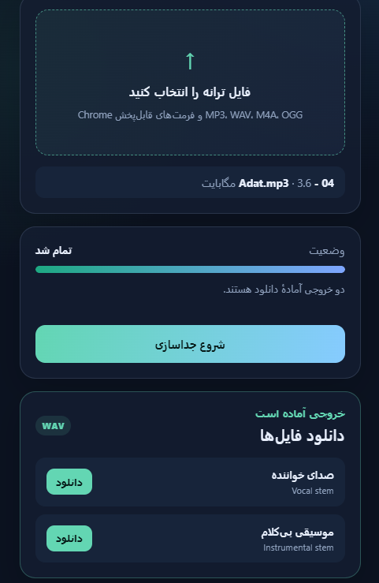
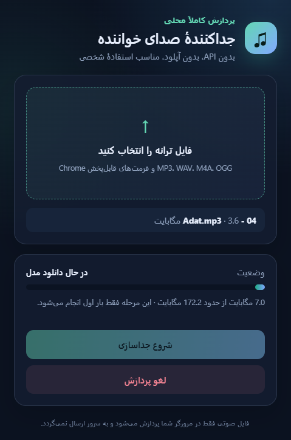

# راهنمای فارسی — جداکننده صدای خواننده (Vocal Splitter Local)

افزونه کروم برای جداسازی صدای خواننده از موزیک، **کاملاً داخل مرورگر شما**. بدون API پولی، بدون آپلود فایل.

## این افزونه چه می‌کند؟

فایل آهنگ را انتخاب می‌کنید، مدل هوش مصنوعی HTDemucs داخل خود کروم اجرا می‌شود و دو فایل WAV تحویل می‌دهد:

- `نام‌آهنگ_vocals.wav` → فقط صدای خواننده
- `نام‌آهنگ_instrumental.wav` → موزیک بی‌کلام (سازها)

## نصب قدم‌به‌قدم (۲ دقیقه)

### روش ۱: نصب از فایل آماده (پیشنهادی)

1. از صفحه GitHub پروژه وارد بخش **Releases** شوید و فایل `vocal-splitter-local-dist.zip` را دانلود کنید.
2. زیپ را Extract کنید تا یک پوشه به اسم `dist` داشته باشید.
3. در کروم آدرس `chrome://extensions` را باز کنید.
4. بالای صفحه **Developer mode** را روشن کنید.
5. دکمه **Load unpacked** را بزنید و پوشه `dist` را انتخاب کنید.
6. افزونه را **Pin** کنید و روی آیکونش کلیک کنید.

### روش ۲: ساخت از سورس

```bash
npm install
npm run build
```

بعد مثل بالا پوشه `dist` را با Load unpacked نصب کنید.

## استفاده

1. روی آیکون افزونه کلیک کنید.
2. فایل آهنگ را بکشید و رها کنید (یا انتخاب کنید): MP3، WAV، M4A، OGG، FLAC.
3. دکمه **شروع جداسازی** را بزنید.
4. صبر کنید تا پیام **تمام شد** بیاید، بعد هر دو فایل را دانلود کنید.



> ⚠️ در اجرای اول، مدل ~۱۷۲ مگابایتی از Hugging Face دانلود می‌شود و در حافظه مرورگر (IndexedDB) کش می‌شود. پس اجرای اول اینترنت می‌خواهد، اجراهای بعدی آفلاین هم کار می‌کند.
>
> ⚠️ تا پایان پردازش، پنجره popup را نبندید. بستن آن پردازش را متوقف می‌کند.



## اگر به مشکل خوردید

| مشکل | راه‌حل |
|---|---|
| دانلود مدل گیر کرد | اینترنت را چک کنید و popup را باز نگه دارید، دوباره تلاش کنید |
| پردازش خیلی طول کشید | طبیعی است؛ فایل طولانی روی CPU چند دقیقه طول می‌کشد. فایل کوتاه‌تر را تست کنید |
| خطای فرمت فایل | فایل را اول در کروم پخش کنید؛ اگر پخش نشد، با Audacity به WAV تبدیل کنید |
| کیفیت جداسازی کامل نیست | روی آهنگ زنده، هم‌خوانی یا افکت سنگین مدل محدودیت دارد |

## حریم خصوصی

فایل صوتی شما به هیچ سروری ارسال نمی‌شود. فقط مدل عمومی از Hugging Face دانلود می‌شود. افزونه به history، کوکی یا تب‌ها دسترسی ندارد.

## تبدیل WAV به MP3 (اختیاری)

```bash
ffmpeg -i input_vocals.wav -codec:a libmp3lame -qscale:a 2 output_vocals.mp3
```
